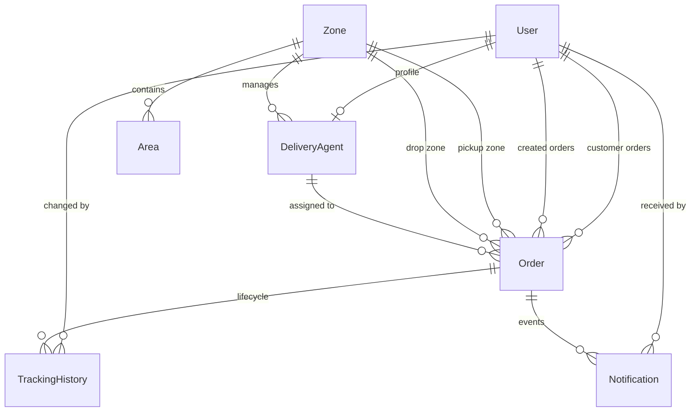

# LastMile - System Design Document

This document presents the system architecture, database schema, core business logic, workflow management, and design principles implemented for the **Last-Mile Delivery Tracker**, a logistics and shipment management platform.

---

## 1. System Architecture

The application follows a **three-tier architecture (Client → Server → Database)**, designed to provide scalability, maintainability, and reliable performance for logistics operations.

```
+--------------------------------------------------------+
|                      React + Vite                      |
|                TypeScript SPA (Frontend)               |
+---------------------------+----------------------------+
                            |
                     REST APIs (HTTPS)
                            |
+---------------------------v----------------------------+
|                  Express.js Backend                    |
|      Controllers, Services, Middleware, Business Logic |
+---------------------------+----------------------------+
                            |
                       Prisma Client
                            |
+---------------------------v----------------------------+
|                PostgreSQL Database                     |
|     Users, Zones, Orders, Rates, Tracking History      |
+--------------------------------------------------------+
```

### Architectural Highlights

* **Prisma ORM** provides type-safe database access, schema migrations, and improved developer productivity.
* **Express.js** serves as the REST API layer with modular routing, middleware, authentication, validation, Helmet, and CORS integration.
* **React + Vite** delivers a fast Single Page Application with optimized builds, hot module replacement, responsive layouts, and modern UI components.
* **JWT Authentication** enables stateless authentication and role-based authorization for **CUSTOMER**, **AGENT**, and **ADMIN** users.

---

## 2. Domain Model & Database Design

The application uses **PostgreSQL** as its primary database. The schema is normalized around eight core entities with carefully designed relationships and indexing strategies for efficient order processing and location-based lookups.



### Entity Overview

1. **User** – Stores user credentials, profile information, and system roles.
2. **Zone** – Represents major delivery regions served by the platform.
3. **Area** – Defines serviceable localities associated with a specific zone using a unique **name + pincode** combination.
4. **RateCard** – Maintains pricing rules based on **Order Type** and **Zone Type**, including base charges, per kilogram cost, and COD fees.
5. **DeliveryAgent** – Stores delivery personnel information, current availability, assigned zone, and operational area.
6. **Order** – Represents shipment details including tracking ID, package dimensions, calculated delivery charges, and routing information.
7. **TrackingHistory** – Maintains a chronological record of every shipment status update.
8. **Notification** – Stores email/SMS notification logs generated during order events.

---

## 3. Business Logic & Processing Engines

### A. Zone Resolution Engine (`zoneEngine.ts`)

When a customer creates an order, the system determines the corresponding delivery zones by matching the pickup and destination areas.

Processing steps:

* Validate pickup and destination locations using **area name** and **pincode**.
* Reject unsupported locations with an HTTP **400 Bad Request** response.
* Determine delivery category:

  * **INTRA_ZONE** – Pickup and destination belong to the same zone.
  * **INTER_ZONE** – Pickup and destination belong to different zones.

---

### B. Dynamic Pricing Engine (`rateEngine.ts`)

The pricing engine calculates shipment charges using industry-standard volumetric weight calculations.

**Volumetric Weight**

[
\text{Volumetric Weight}=\frac{\text{Length}\times\text{Breadth}\times\text{Height}}{5000}
]

**Billable Weight**

[
\text{Billable Weight}=\max(\text{Actual Weight},\text{Volumetric Weight})
]

**Final Delivery Charge**

[
\text{Total Charge}=
\text{Base Rate}
+
(\text{Billable Weight}\times\text{Per Kg Rate})
+
\text{COD Surcharge}
]

The engine retrieves the applicable **RateCard** using the selected **Order Type** and **Zone Type**, then computes the final delivery cost.

---

### C. Delivery Agent Assignment Engine (`assignmentEngine.ts`)

To eliminate duplicate assignments during concurrent requests, agent allocation is executed inside **serializable database transactions**.

Assignment workflow:

1. Verify the selected agent is currently **AVAILABLE**.
2. Lock the record within the transaction.
3. Mark the agent as **BUSY**.
4. Assign the agent to the order.
5. If another transaction attempts to assign the same agent simultaneously, it is safely rejected and another available agent can be selected.

---

## 4. Order Lifecycle Management

The application enforces a predefined state transition model to ensure that shipment progress follows valid business rules.

```
                +------------+
                |  PENDING   |
                +-----+------+
                      |
                +-----v------+
                | PICKED_UP  |
                +-----+------+
                      |
                +-----v------+
                | IN_TRANSIT |
                +-----+------+
                      |
             +--------v--------+
             | OUT_FOR_DELIVERY|
             +--------+--------+
                      |
             +--------+--------+
             |                 |
       +-----v-----+     +-----v-----+
       | DELIVERED |     |  FAILED   |
       +-----------+     +-----+-----+
                               |
                         Reschedule
                               |
                               v
                           PENDING
```

### State Transition Rules

* **DELIVERED** is a terminal state and cannot transition further.
* Orders marked **FAILED** remain unchanged until a customer requests rescheduling.
* Rescheduling:

  * resets the order to **PENDING**
  * increments the delivery attempt count
  * releases the assigned delivery agent
  * triggers a fresh agent assignment

---

## 5. Audit Trail & Tracking History

Every shipment update generates a new entry in the **TrackingHistory** table instead of modifying previous records.

Each event stores:

* Current shipment status
* Timestamp
* User responsible for the update
* Optional remarks

This append-only strategy provides a complete audit trail for tracking shipment activity and resolving operational disputes.

---

## 6. Notification Processing

Notification delivery is handled asynchronously to prevent external communication delays from impacting core business operations.

The notification service:

* Dispatches email and SMS events asynchronously.
* Records successful deliveries.
* Logs failures independently without interrupting order creation or status updates.

---

## 7. Role-Based Frontend Architecture

The frontend implements secure route protection using React Router and provides dedicated dashboards for each user role.

### Customer Dashboard

* Create shipment requests
* Estimate delivery charges
* Track shipment history
* View recent activities
* Reschedule failed deliveries

### Agent Dashboard

* Update availability status
* View assigned deliveries
* Perform shipment status transitions
* Access a mobile-friendly delivery workflow

### Admin Dashboard

* Manage zones and service areas
* Configure pricing rules
* Monitor operational statistics
* Manage delivery agents
* Assign or reassign deliveries
* Supervise the complete order lifecycle
